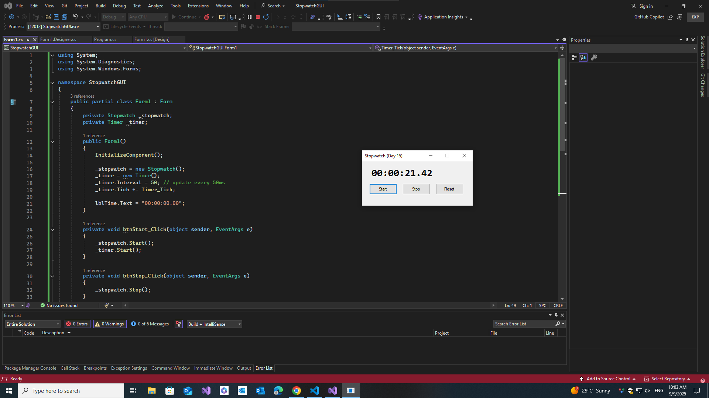

# ⏱️ Stopwatch GUI (C# WinForms App)

This is Day 15 of my 30-Day C# Project-Based Learning Plan.
A simple Stopwatch desktop app built with Windows Forms in C#.
It can start, stop, and reset time while updating in real-time.

--- 

## 🚀 Features

- Start button → begins timing.

- Stop button → pauses stopwatch.

- Reset button → clears time to 00:00:00.00.

- Real-time updates using Timer.

- Time format: hh:mm:ss.ms.
--- 
## 🛠️ Tech Stack

- C# 7.3

- .NET Framework / WinForms

- Visual Studio IDE
---

## 📸 Screenshots

| ⏱️ | 
|--------------|
|  |

---

## 📚 Learning Goals

This project taught me:

- Using Stopwatch class and System.Windows.Forms.Timer.

- Formatting TimeSpan for digital clock output.

- Handling button events for app state (running vs stopped).

- Structuring a WinForms app with partial classes (Form1.cs + Form1.Designer.cs).
